# Tenscenery
Images of tensors, such as ...

Add or edit whatevery you think would fit the world of imagining tensors, but keep this public and shared under Creative-Commons 4.0 "CC-BY."

# Table of Contents
1. [General](#gallery-of-tensors)
2. [Products](#gallery-of-products)
3. [Contractions](#gallery-of-contractions)
4. [Actions](#gallery-of-actions)
5. [Encoding](#gallery-of-encodings)
6. [Shuffles](#gallery-of-shuffles)
7. [Stacks](#gallery-of-stacks)
8. [Slices](#gallery-of-slices)

---

# Gallery of Tensors

1. 
2. 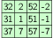
3. 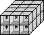
4. 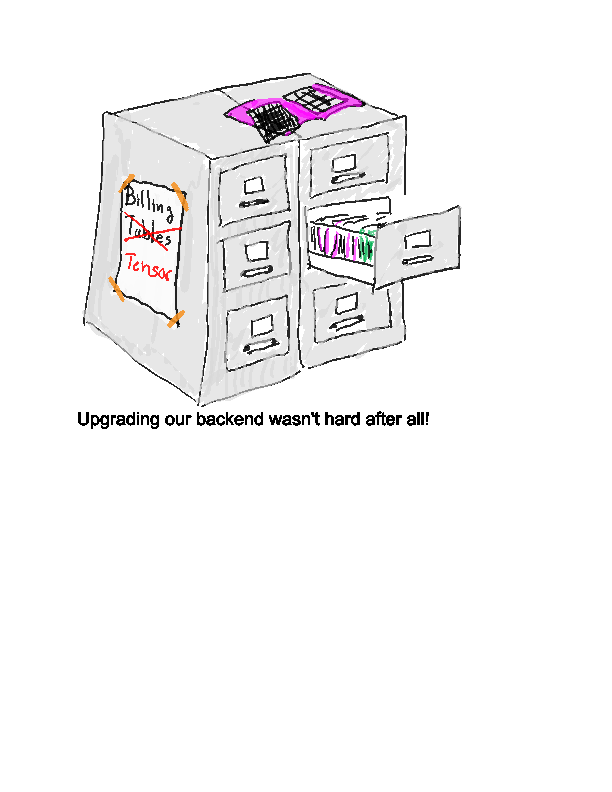

--- 

# Gallery of Products

 1. 
 2. 
 3. 
 4. 

---

# Gallery of Contractions

 1. 
 2. 
 3. 
 4. 
 5. 
 6. 

---

# Gallery of Actions

 1. 
 2. 
 3. 
 4. 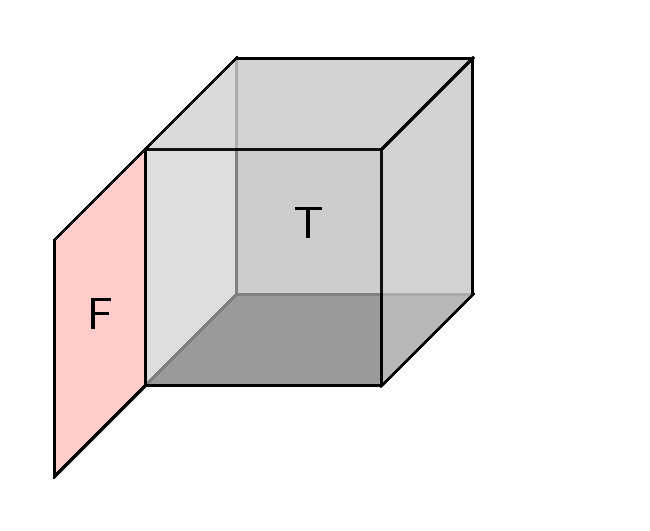
 5. 
 6. 
 7. 

--- 
# Gallery of Encodings

 1. 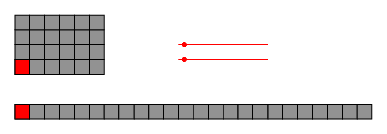
 1. 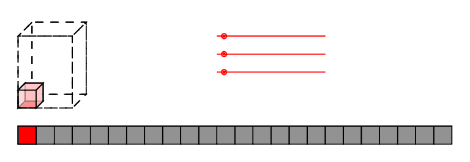

--- 

# Gallery of Shuffles

1. 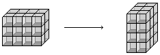
1. 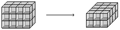
1. 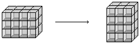
1. 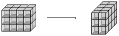
1. 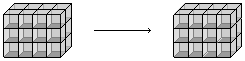

---

# Gallery of Stacks

1. 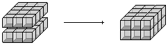
1. 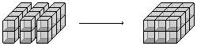
1. 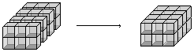

# Gallery of Slices
