# Tenscenery
Images of tensors, such as ...

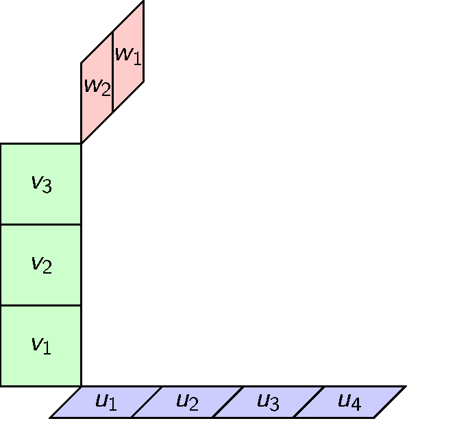

Add or edit whatevery you think would fit the world of imagining tensors, but keep this public and shared under Creative-Commons 4.0 "CC-BY."

---

# Gallery of General Tensors

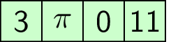
1-Tensor.gif (and static in .png)

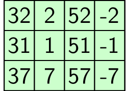
2-Tensor.gif (and static in .png)

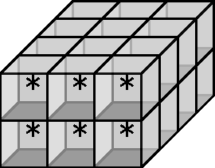
3-Tensor.gif (and .png)

# Gallery of Tensor/Vector/Matrix/Outer Product Animations

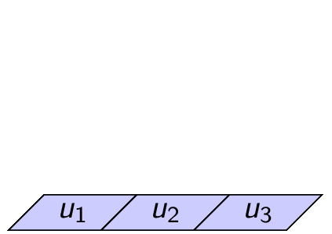
Tensor-Product-Def-2D.gif

Tensor-Product-Def-3D.gif

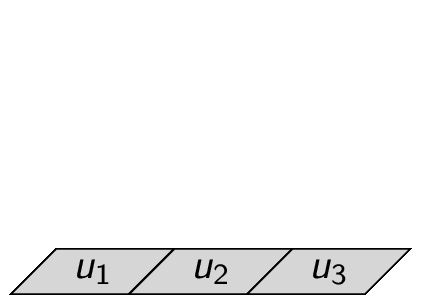
Tensor-Product-Def-2D-BW.gif

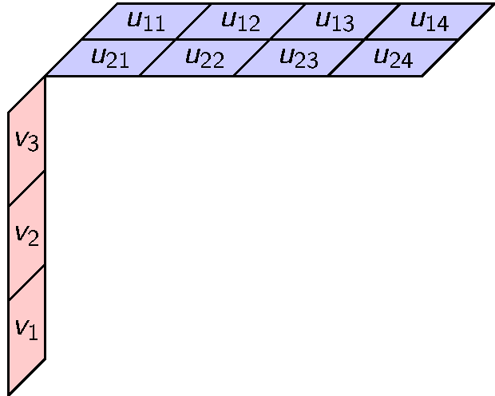
Tensor-Product-Def-2-1-D.gif

# Gallery of Tensor Contractions

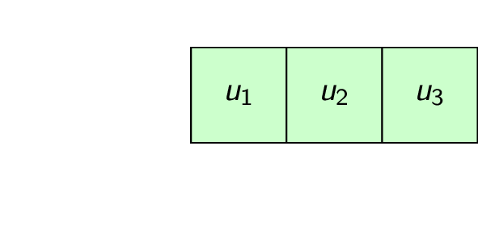
Contract-1D.gif

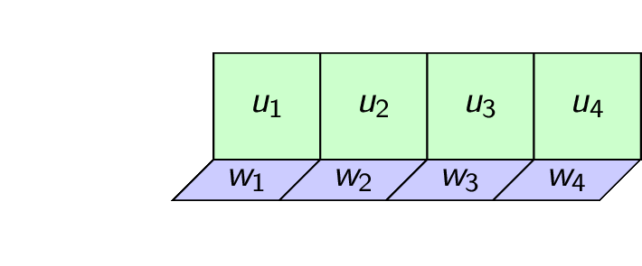
Contract-1D-Weighted.gif

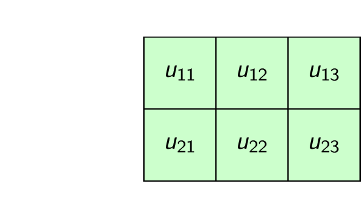
Contract-2D-H.gif

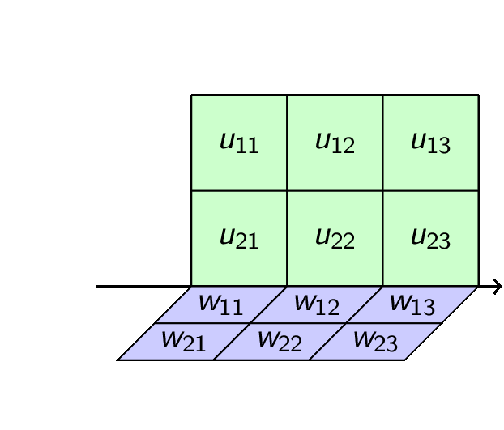
Contract-2D-H-Weighted.gif

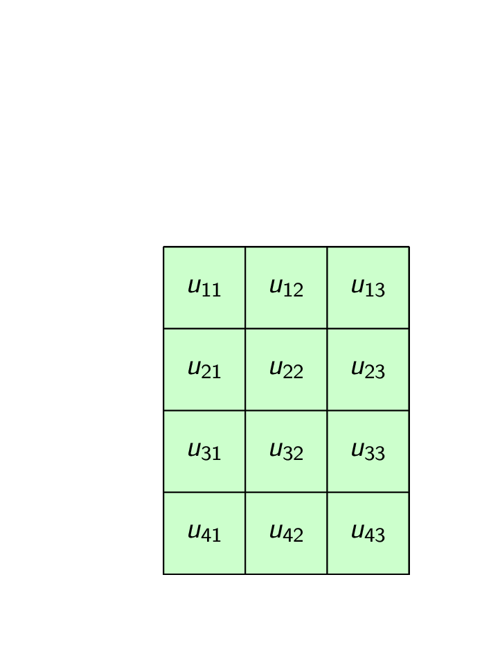
Contract-2D-V.gif

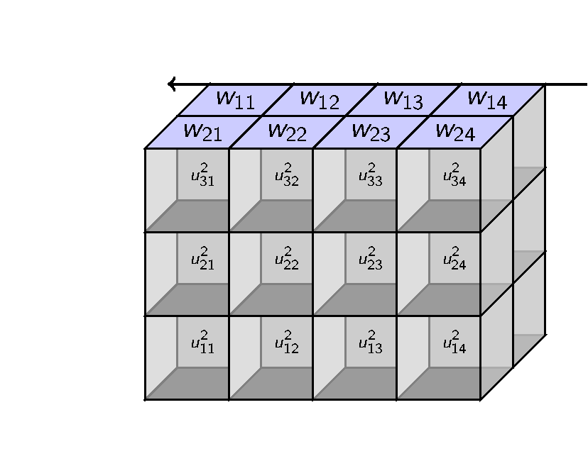
Contract-2-1-D.gif

# Gallery of Tensor Operators

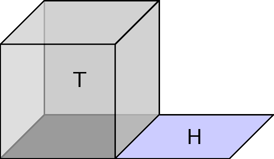
Act-0.png (and .gif)

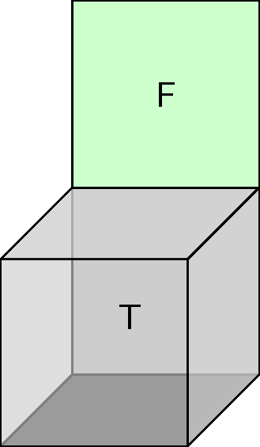
Act-1.png (and .gif)

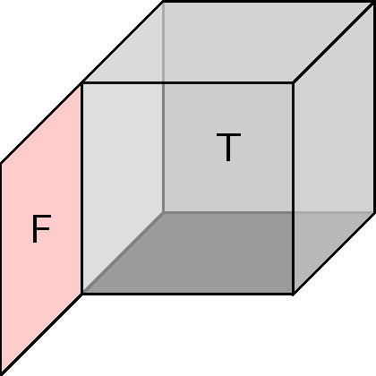
Act-2.png (and .gif)

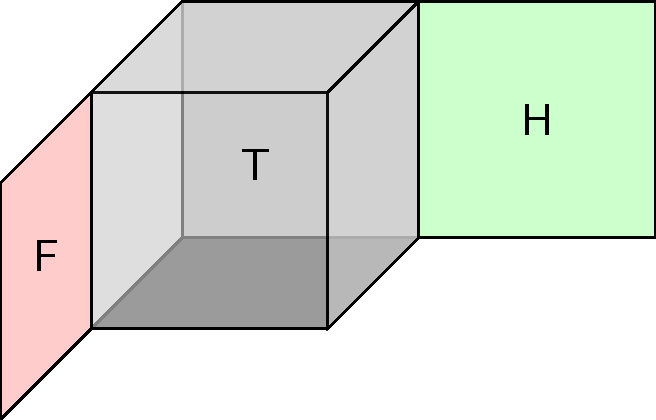
Act-20.png (and .gif)

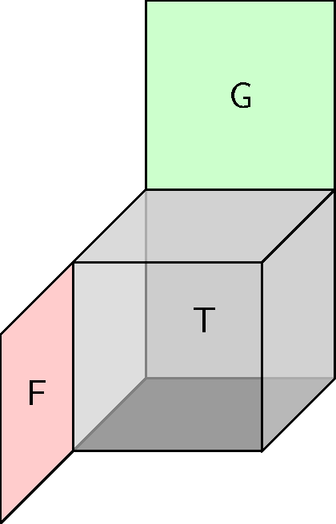
Act-21.png (and .gif)

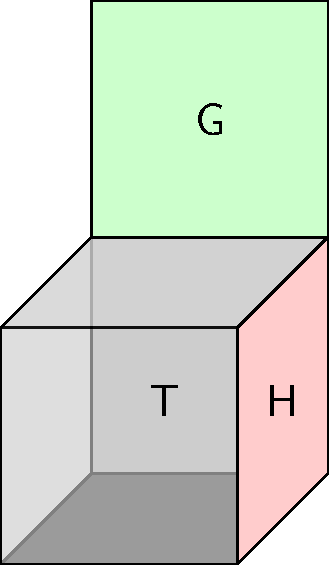
Act-10.png (and .gif)
