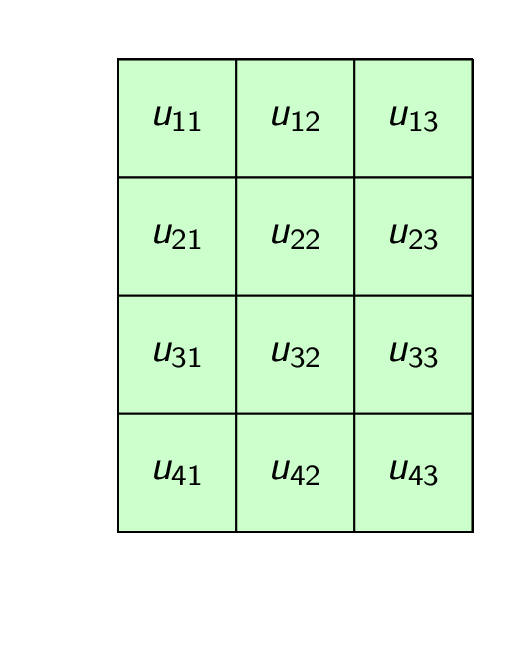
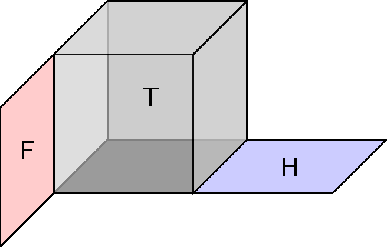

# Tenscenery
Images of tensors, such as ...

Add or edit whatevery you think would fit the world of imagining tensors, but keep this public and shared under Creative-Commons 4.0 "CC-BY."

---

# Gallery of General Tensors

1-Tensor.gif (and static in .png)

2-Tensor.gif (and static in .png)

3-Tensor.gif (and .png)

# Gallery of Tensor/Vector/Matrix/Outer Product Animations

Tensor-Product-Def-2D.gif

Tensor-Product-Def-3D.gif

Tensor-Product-Def-2D-BW.gif

Tensor-Product-Def-2-1-D.gif

# Gallery of Tensor Contractions

Contract-1D.gif

Contract-1D-Weighted.gif

Contract-2D-H.gif

Contract-2D-H-Weighted.gif

Contract-2D-V.gif

Contract-2-1-D.gif

# Gallery of Tensor Operators

Act-0.png (and .gif)

Act-1.png (and .gif)

Act-2.png (and .gif)

Act-20.png (and .gif)

Act-21.png (and .gif)

Act-10.png (and .gif)
